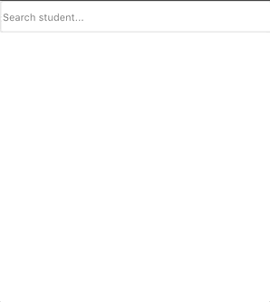

# TypeAhead Dropdown



TypeAhead Dropdown is a ReactJS UI component that allows you to search based on the text that you give in the input and also you have options Previous and Next to see all results based on the query that you have made.

## Getting Started

These instructions will help you how to implement and use this UI component.

### Prerequisites

You should install this component in ReactJS application otherwise will not work.

If you don't specify (data) prop when you use TypeAheadDropdown then in the dropdown you will see the default list that I have implemented for testing.

You must declare these methods in the component otherwise will not work:

```
getFullName(fullName) {
  console.log(fullName);
}
btnPrevious() {
  console.log("previous button clicked");
}
btnNext() {
  console.log("next button clicked");
}
```

### Installing

To install this package you should run:

```
npm install TypeAheadDropdown --save
```

After installing you are ready to use it by importing:

```
import TypeAheadDropdown from 'TypeAheadDropdown'
```

Now you can use it in component

```
class TypeAhead extends React.Component {
  getFullName(fullName) {
    console.log(fullName);
  }
  btnPrevious() {
    console.log("previous button clicked");
  }
  btnNext() {
    console.log("next button clicked");
  }
  render() {
    return (
      <TypeAheadDropdown
        getFullName={this.getFullName}
        btnPrevious={this.btnPrevious}
        btnNext={this.btnNext}
        firstButton="Previous"
        secondButton="Next"
      />
    );
  }
}
```

## User guide

| Prop name            | Description                                                            | Required |
| -------------------- | ---------------------------------------------------------------------- | -------- |
| getFullName          | This function will return full name of the selected item from dropdown | Yes      |
| btnPrevious          | Function to manipulate list                                            | Yes      |
| btnNext              | Function to manipulate list                                            | Yes      |
| data                 | Array with object's that have properties name and surname              | No       |
| firstButton          | Title of the first button                                              | No       |
| secondButton         | Title of the second button                                             | No       |
| btnBackgroundColor   | Background-color of the button's, example 'red'                        | No       |
| btnTextColor         | Text color of the button's                                             | No       |
| btnfFooterBackground | Background-color of the div where button's are placed                  | No       |
| ulBackgroundColor    | Background-color of the unordered list                                 | No       |
| liColor              | List item color                                                        | No       |
| height               | Height of the text input                                               | No       |
| width                | Width of the text input                                                | No       |

## Data prop example

```
[
  {
    name: "Imce",
    surname: "Elezi",
    age: 25
  },
  {
    name: "Neim",
    surname: "Elezi",
    age: 25
  },
  {
    name: "Aldion",
    surname: "Ambari",
    age: 23
  },
  {
    name: "Arian",
    surname: "Derdo",
    age: 25
  },
  {
    name: "Brian",
    surname: "Haas",
    age: 26
  }
];
```

## Author

- **Neim Elezi aka Imce** - (https://github.com/imceZZ)

## License

This project is licensed under the MIT License - see the [LICENSE](LICENSE) file for details
